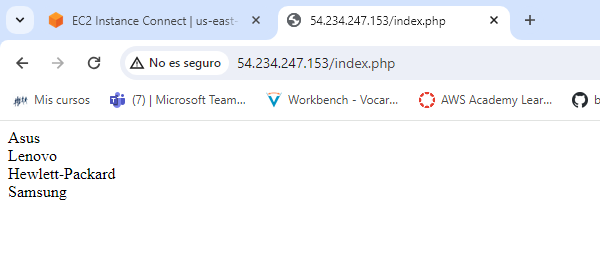

# Instalar LAMP con dockers

### Para esta parte, lo que haré sera crear un dockerfile que me haga la imagen de Apache a mi medida. Despues con docker compose, iniciare un LAMP tomando mi propia imagen del Apache.

## Creo Dockerfile:

## Creo la carpeta src donde estara la info del sitio 

## Creo el index.php dentro...

## También cree el conf de apache y lo meti en la carpeta /conf:

## Creare la imagen con `docker build - t`

## Creo la carpeta sql con la base de datos:

## Ahora, el archivo que creará el LAMP es el docker-compose.yml que queda asi:

## Lanzo con `docker compose up -d`

## Resultado...

## * Al final tuve un problema porque en el dockerfile no indiqué que copiase el contenido de /conf a sites-available del servidor...
### Esto hacía que no me llevase al index.php porque por defecto esta index.html

## Modifico el dockerfile...

### Creare una imagen con la etiqueta v2...

## Solo falta modificar el compose para que use esa nueva imagen...

## Resultado...

